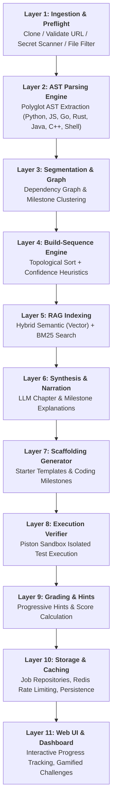

# 🚀 Backtrace: Automated Codebase Reverse-Engineering & Build-Sequence Reconstruction

[](https://www.python.org/downloads/)
[](https://fastapi.tiangolo.com/)
[](https://www.docker.com/)
[](LICENSE)

> **Learn any codebase by watching how it was built, step-by-step.**

---

## 🌟 What is Backtrace?

Traditional code exploration tools (like DeepWiki or typical RAG searchers) explain **what a codebase is right now**. 

**Backtrace does something fundamentally different:** it performs **Build-Sequence Reconstruction**. By combining deterministic multi-language AST parsing, dependency graph topological sorting, and semantic synthesis, Backtrace reconstructs the logical development timeline of an entire repository.

It breaks down complex repositories into progressive **Milestones**, generates architectural narratives, provides AI-guided hints, and lets you verify your own implementation attempts inside an isolated **Piston code execution sandbox**.

---

## 🏗️ The 11-Layer Pipeline Architecture

Backtrace processes repositories through an autonomous 11-layer deterministic and AI pipeline:



---

## 📂 Project Directory Structure

Here is a roadmap of the repository to help you find your way around:

```text
Reverse/
├── app/                        # 🧠 Main Application Source Code
│   ├── api/                    # FastAPI route handlers (analysis, attempts, auth, health, UI)
│   ├── core/                   # Global configuration, logging, settings
│   ├── db/                     # Database engine & session management (SQLite / PostgreSQL)
│   ├── formatters/             # Output exporters (Markdown, JSON reports)
│   ├── models/                 # SQLAlchemy DB schemas & Pydantic validation models
│   ├── monitoring/             # Prometheus metrics, telemetry, health monitors
│   ├── orchestration/          # 11-layer pipeline execution orchestrator
│   ├── parser/                 # Multi-language AST parsers (Python, JS/TS, Go, Rust, Java, C++, Shell)
│   ├── rag/                    # Hybrid semantic chunking, vector embeddings & search
│   ├── security/               # Secret scanning, rate limiters, seccomp filters
│   ├── segmentation/           # Milestone clustering & dependency graph building
│   ├── sequence/               # Build-sequence reconstruction algorithms
│   ├── services/               # Piston sandbox runner, LLM synthesis, hints engine
│   ├── storage/                # Analysis job caching & file persistence
│   ├── synthesis/              # LLM prompt construction & milestone narration
│   ├── ui/                     # Web dashboard templates, components, and static assets
│   └── utils/                  # Git utilities, subpath extractors, subprocess helpers
├── alembic/                    # 🗄️ Database Migrations (Schema version control)
├── docker/                     # 🐳 Container configurations (Nginx reverse proxy, etc.)
├── docs/                       # 📚 Detailed Architecture, Decisions Log, and Specs
├── scripts/                    # 🛠️ Utility scripts (Database backup/restore, verification, parsers)
├── tests/                      # 🧪 Test Suite (Unit tests, integration tests, real repo fixtures)
├── scratch/                    # 📝 Temporary scratch space, logs, and debug artifacts (gitignored)
├── docker-compose.yml          # 🚀 Full-stack Docker compose configuration
├── Dockerfile                  # 🐳 Application container definition
├── requirements.txt            # 📦 Python project dependencies
├── alembic.ini                 # ⚙️ Alembic migration settings
├── pytest.ini                  # 🧪 Pytest configuration
└── README.md                   # 📖 This guide!
```

---

## 🚀 Quick Start Guide

You can run Backtrace locally using either **Docker** (recommended for full environment) or a **Local Virtual Environment**.

### Option A: Using Docker (Fastest & Recommended)

Make sure you have [Docker Desktop](https://www.docker.com/products/docker-desktop/) installed and running.

1. **Clone the repository:**
   ```bash
   git clone https://github.com/SumitMahajan11/Backtrace.git
   cd Backtrace
   ```

2. **Set up your environment variables:**
   ```bash
   cp .env.example .env
   ```
   *Edit `.env` and add your `GEMINI_API_KEY` or custom configuration if needed.*

3. **Start the stack:**
   ```bash
   docker compose up --build
   ```

4. **Access the application:**
   - 🌐 **Web Dashboard:** [http://localhost:8000](http://localhost:8000)
   - 📑 **Interactive API Docs:** [http://localhost:8000/docs](http://localhost:8000/docs)
   - 📊 **Health Check:** [http://localhost:8000/api/health](http://localhost:8000/api/health)

---

### Option B: Local Python Development Setup

If you prefer running without Docker:

#### 1. Prerequisites
- **Python 3.11+** installed
- **Git** installed
- *(Optional)* Go, Rust, or Node.js if compiling native companion parsers

#### 2. Create and activate a virtual environment

**On Windows (PowerShell):**
```powershell
python -m venv .venv
.venv\Scripts\Activate.ps1
```

**On Linux / macOS:**
```bash
python3 -m venv .venv
source .venv/bin/activate
```

#### 3. Install dependencies
```bash
pip install -r requirements.txt
```

#### 4. Configure environment
```bash
cp .env.example .env
```

#### 5. Run Database Migrations
```bash
alembic upgrade head
```

#### 6. Start the development server
**On Windows:**
```powershell
.\run_dev.ps1
```
*(or run directly via uvicorn:)*
```bash
uvicorn app.api.main:app --host 0.0.0.0 --port 8000 --reload
```

---

## 🧪 Running Tests

Backtrace has a comprehensive test suite covering all 11 architectural layers:

```bash
# Run the entire test suite
python -m pytest

# Run fast unit tests only
python -m pytest tests/test_python_parser.py tests/test_sequence_baseline.py

# Run with verbose output and test names
python -m pytest -v

# Run with coverage report
python -m pytest --cov=app tests/
```

For more details on test fixtures and test organization, check [tests/README.md](tests/README.md).

---

## 🛠️ Multi-Language AST Parsers

Backtrace natively extracts AST nodes, function calls, class hierarchies, and imports across 8 languages:

| Language | Parser Implementation | Details |
| :--- | :--- | :--- |
| **Python** | Python `ast` Standard Library | Full AST extraction & dependency tracking |
| **JavaScript / TypeScript** | Babel / Esprima parser bridge | Functions, ES6 modules, JSX |
| **Go** | Native Go AST binary (`go_parser`) | Structs, interfaces, packages |
| **Rust** | `syn` + Tree-Sitter (`rust_parser`) | Traits, structs, impl blocks, crates |
| **Java** | `javalang` parser | Classes, methods, packages |
| **C / C++** | `tree-sitter-cpp` / Regex AST | Headers, classes, functions |
| **Shell / Bash** | Bash AST parser | Commands, functions, sourcing |
| **TLA+** | Spec parser | Module specifications & temporal logic |

---

## ⚙️ Key Environment Variables

| Variable | Default | Purpose |
| :--- | :--- | :--- |
| `DATABASE_URL` | `sqlite:///./app.db` | Main database connection string (PostgreSQL or SQLite) |
| `REDIS_URL` | `redis://localhost:6379/0` | Rate limiting & async task message broker |
| `GEMINI_API_KEY` | *(Optional)* | Google Gemini API key for Layer 6 LLM narration & hints |
| `PISTON_API_URL` | `http://localhost:2000/api/v2` | Piston sandboxed code execution engine endpoint |
| `RATE_LIMIT_PER_MINUTE` | `60` | Global API rate limit per IP |
| `ENV` | `development` | Deployment environment (`development` / `production`) |

---

## 📚 Deep Dive Documentation

For in-depth architectural reasoning, design logs, and operational manuals:

- 🏛️ [ARCHITECTURE.md](docs/ARCHITECTURE.md) — Detailed 11-layer architecture specification
- 🧰 [TECH_STACK.md](docs/TECH_STACK.md) — Technology stack choices and trade-off analysis
- 📝 [DECISIONS_LOG.md](docs/DECISIONS_LOG.md) — Comprehensive ADR (Architectural Decision Records)
- 🚢 [DEPLOYMENT.md](DEPLOYMENT.md) — Production deployment & infrastructure guide
- 🛡️ [BACKUP_DISASTER_RECOVERY.md](docs/BACKUP_DISASTER_RECOVERY.md) — Database backup and recovery procedures

---

## 🤝 Contributing

1. Fork the repository
2. Create your feature branch (`git checkout -b feature/amazing-feature`)
3. Commit your changes (`git commit -m "feat: add amazing feature"`)
4. Push to the branch (`git push origin feature/amazing-feature`)
5. Open a Pull Request

---

## 📄 License

Distributed under the MIT License. See `LICENSE` for more information.
