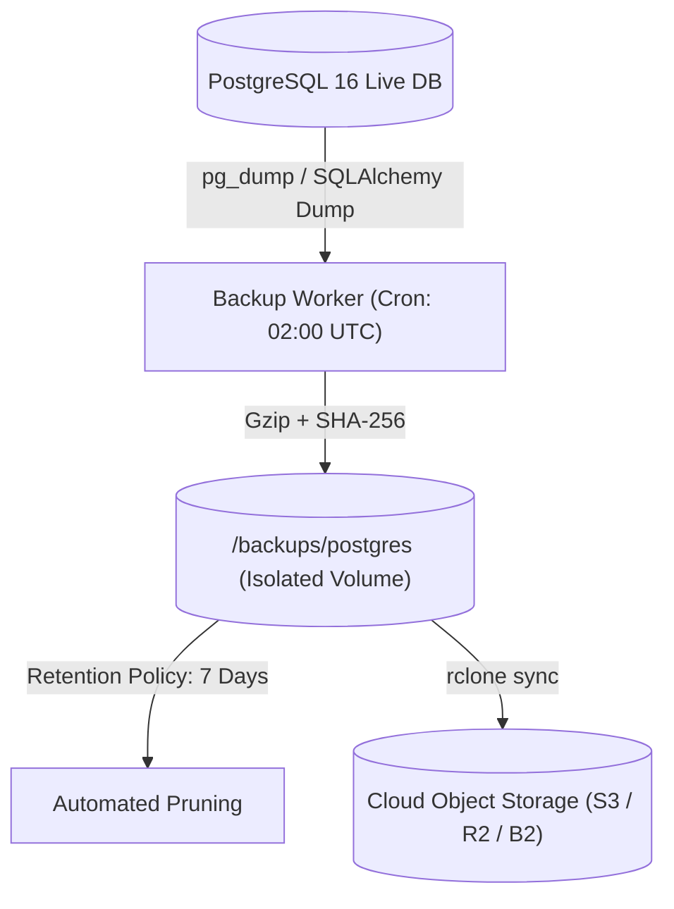

# Database Backup, Retention & Disaster Recovery Runbook (Prompt 29)

This runbook establishes the disaster recovery, automated backup, integrity verification, and data restoration policies for the **Backtrace** PostgreSQL database engine.

---

## 1. Disaster Recovery Objectives

| Metric | Target | Description |
| :--- | :--- | :--- |
| **RPO (Recovery Point Objective)** | **< 24 Hours** (Daily Snapshots) / **< 15 Mins** (WAL archiving) | Maximum acceptable data loss window in the event of hardware or storage failure. |
| **RTO (Recovery Time Objective)** | **< 5 Minutes** | Maximum acceptable downtime to restore the database and return the API to 200 OK health. |
| **Integrity Assurance** | **SHA-256 Digest Verification** | Every backup is cryptographically verified before any restore operation is executed. |

---

## 2. Retention Schedule & Storage Architecture

### Backup Retention Policy
- **Daily Snapshots**: Retained for **7 days** with automated daily pruning.
- **Weekly Snapshots**: Retained for **4 weeks** (Sunday 02:00 UTC backups are preserved).
- **Monthly Snapshots**: Retained for **12 months** (1st of every month).

### Storage Tiering & Isolation
- **Primary Live DB Volume**: `postgres_data` mounted at `/var/lib/postgresql/data`.
- **Secondary Backup Volume**: `postgres_backups` mounted at `/backups/postgres` (physically distinct persistent volume).
- **Off-Site Object Storage (Optional/Recommended)**: Mirrored to S3/B2/R2 via `rclone` or AWS CLI.



---

## 3. Automated Backup Configuration

### Crontab Schedule (`sudo crontab -e`)
```cron
# Run daily database backup at 02:00 UTC
0 2 * * * docker exec backtrace_production_app python scripts/backup_postgres.py --dest /data/backups/postgres --retention 7 >> /data/logs/backup.log 2>&1

# Sync backups to off-site object storage at 02:30 UTC
30 2 * * * rclone sync /data/backups/postgres s3:backtrace-backups-prod/db-backups/ --quiet
```

---

## 4. Disaster Recovery & Restoration Procedure

### Scenario A: Full Host or Database Corruption Recovery

1. **Verify Backup Archive & Integrity**:
   ```bash
   python scripts/restore_postgres.py --backup-path backups/postgres/backtrace_backup_20260918_120000Z.sql.gz --target-db-url "$DATABASE_URL"
   ```

2. **Manual Docker Container Restore via CLI**:
   ```bash
   # Decompress backup
   gunzip -c /backups/postgres/backtrace_backup_20260918_120000Z.sql.gz > /tmp/restore.sql

   # Restore into PostgreSQL container
   docker exec -i backtrace_postgres psql -U postgres -d backtrace < /tmp/restore.sql

   # Clean up temp file
   rm /tmp/restore.sql
   ```

3. **Verify Restored Application Health**:
   ```bash
   curl -f http://localhost:8000/health
   ```

---

## 5. Automated Reconciliation Verification

Every restore operation automatically performs table-by-table record reconciliation across all 8 core entities:
- `users`: GitHub OAuth identities and admin roles.
- `repos`: Analyzed repository cache and retention consent.
- `analysis_jobs`: Reverse engineering runs, graph outputs, and quizzes.
- `milestone_attempts`: Code submissions, grading results, and execution logs.
- `subscriptions`: Stripe customers and active pro subscriptions.
- `usage_events`: Immutable monthly quota audit ledger.
- `points_ledger`: Milestone completion and hint deduction points.
- `processed_webhook_events`: Idempotent Stripe webhook deduplication records.
